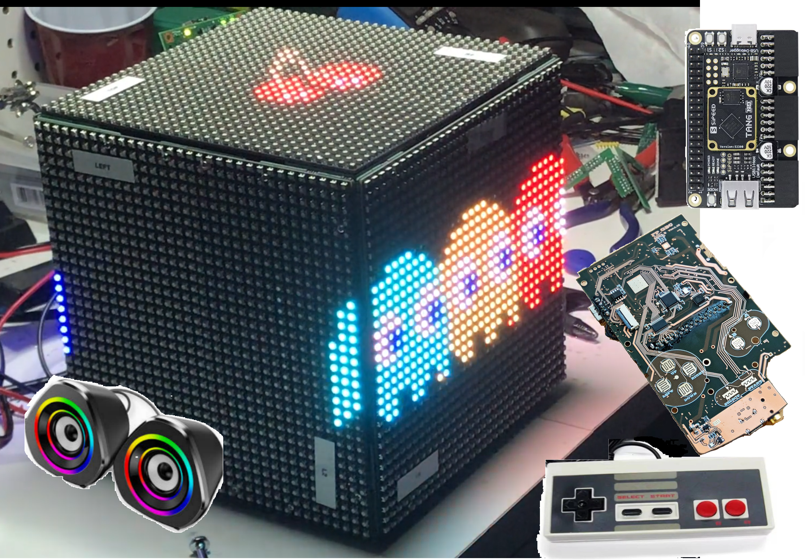
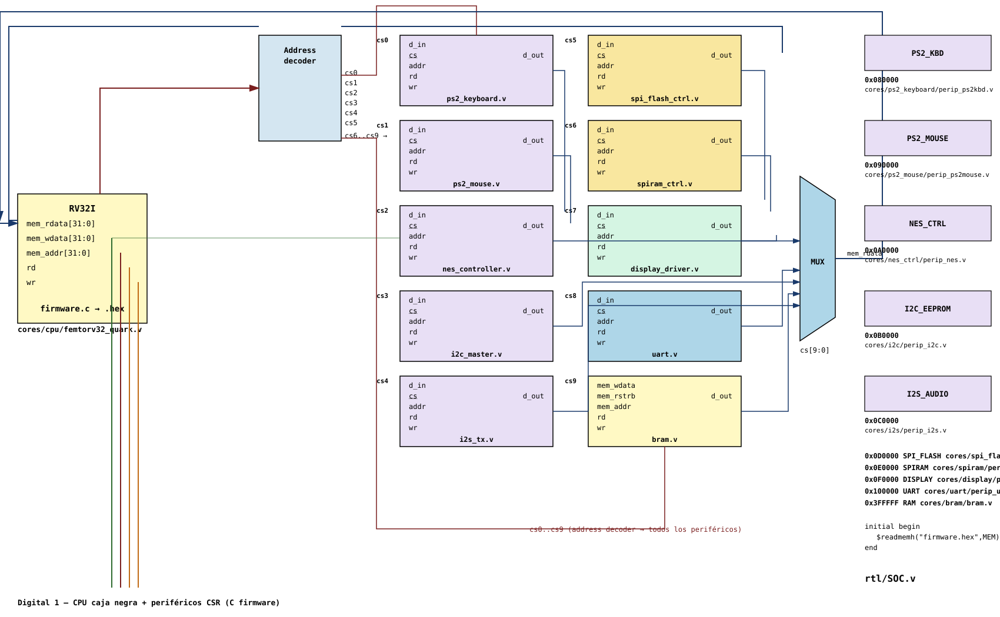

# Proyecto PBL — Videojuego en FPGA (Digital 1)

## Descripción

Proyecto de aprendizaje basado en problemas (PBL) del curso **Diseño Digital 1**. Los estudiantes implementan, en equipos, los periféricos de una mini-consola de videojuegos sobre FPGA, siguiendo la metodología top-down del curso: **flowchart → ASM → RTL → hardware**.

El procesador (RV32I / femtorv32) se usa como **caja negra**: los estudiantes no lo modifican ni lo diseñan. Programan la lógica del juego en **C**, y diseñan en **RTL** los periféricos que ese firmware controla a través de registros mapeados en memoria (CSR).

A diferencia de que cada equipo entregue un juego completo por separado (con alto riesgo de copias entre equipos), el curso implementa **una sola plataforma de juego compartida**: cada equipo es dueño de un módulo de comunicación/periférico distinto (protocolo PS/2, NES, I2C, I2S, SPI), y la integración final requiere que todos los equipos colaboren sobre el mismo bus.

## La idea del proyecto

El resultado esperado es una **consola de videojuegos retro construida en FPGA**: un procesador corriendo el firmware del juego, un panel de LEDs como pantalla, y periféricos de entrada estándar (teclado, mouse, control tipo NES) conectados por los protocolos que se enseñan en el curso.


*Vista general del sistema: panel LED, cableado y placa de control.*

## Diagrama de bloques (SoC)



El decodificador de direcciones genera las señales `cs0`–`cs9` a partir de `mem_addr`. Cada periférico expone el mismo contrato de puertos (`d_in`, `cs`, `addr`, `rd`, `wr`, `d_out`), y un mux selecciona el `d_out` activo hacia `mem_rdata` según `cs[9:0]`.

## Mapa de memoria

| Rango | Periférico | Archivo RTL |
|---|---|---|
| `0x000000 - 0x3FFFFF` | BRAM (boot / firmware) | `cores/bram/bram.v` |
| `0x400000 - 0x40FFFF` | UART (debug) | `cores/uart/perip_uart.v` |
| `0x410000 - 0x41FFFF` | SPI-RAM | `cores/spiram/perip_spiram.v` |
| `0x420000 - 0x42FFFF` | SPI-Flash | `cores/spi_flash/perip_spiflash.v` |
| `0x430000 - 0x43FFFF` | Teclado PS/2 | `cores/ps2_keyboard/perip_ps2kbd.v` |
| `0x440000 - 0x44FFFF` | Mouse PS/2 | `cores/ps2_mouse/perip_ps2mouse.v` |
| `0x450000 - 0x45FFFF` | Control NES | `cores/nes_ctrl/perip_nes.v` |
| `0x460000 - 0x46FFFF` | I2C (EEPROM / puntajes) | `cores/i2c/perip_i2c.v` |
| `0x470000 - 0x47FFFF` | I2S (audio) | `cores/i2s/perip_i2s.v` |
| `0x480000 - 0x4FFFFF` | Display (framebuffer, 512 KB) | `cores/display/perip_display.v` |

La ventana de `DISPLAY` se dejó amplia a propósito para dar espacio suficiente a la memoria de video (framebuffer), independientemente de si el panel objetivo es WS2812 o HUB75 64×64/32×32.

## Organización del curso

- El curso se dividirá en **equipos**, cada uno responsable de un módulo periférico (protocolo de comunicación) + su firmware C de prueba.
- Cada equipo será responsable de planificar, implementar, verificar, documentar e integrar las tareas que le hayan sido asignadas.
- El core del juego (FSM de estado, sprites, colisión) y el driver de panel/framebuffer se entregan como **andamiaje** — no los diseñan los equipos, para que el esfuerzo se concentre en el objetivo pedagógico: manejo de protocolos (SPI, I2C, PS/2, I2S) y memoria externa desde C.
- La integración final conecta todos los módulos sobre el mismo bus CSR — un módulo que falla es visible en la demo de todo el curso, no solo del equipo responsable.

## Planificación y repositorios

El proyecto debe mantener un **planificador o cronograma compartido**. Para cada actividad se debe registrar como mínimo:

| Campo | Contenido |
|---|---|
| Tarea | Actividad concreta que debe realizarse |
| Responsable | Equipo y estudiante encargado |
| Fecha de inicio | Momento previsto para comenzar |
| Fecha de entrega | Momento previsto para finalizar |
| Dependencias | Tareas o módulos necesarios para comenzar |
| Estado | Pendiente, en desarrollo, bloqueada o terminada |
| Evidencia | Enlace al código, simulación, documento o prueba correspondiente |

Debe existir un **repositorio general del curso** que contenga la arquitectura compartida, las interfaces, el mapa de memoria, la plantilla y los elementos de integración. Cada equipo trabajará en su propio repositorio. El repositorio general distribuirá las actualizaciones comunes hacia los repositorios de los equipos, y los resultados validados de cada equipo deberán regresar al repositorio general mediante el mecanismo de integración definido para el curso.

Cada tarea debe tener un responsable explícito. La responsabilidad colectiva del equipo no reemplaza la asignación individual de actividades dentro del cronograma.

### Planificador recomendado: GitHub Projects

Se recomienda utilizar un **GitHub Project** asociado al repositorio general. Cada tarea debe crearse como un *issue* en el repositorio correspondiente y agregarse al proyecto general. El proyecto debe utilizar una vista de tabla para seguimiento y una vista de *roadmap* para el cronograma.

Configurar los siguientes campos:

- `Estado`: pendiente, en desarrollo, bloqueada o terminada;
- `Equipo`;
- `Responsable`;
- `Fecha de inicio`;
- `Fecha de entrega`;
- `Dependencias`;
- `Repositorio`;
- `Evidencia / Pull request`.

La plantilla de planificación y el formulario para crear tareas se encuentran en [`template/planificacion/`](./template/planificacion/) y [`template/.github/ISSUE_TEMPLATE/tarea.yml`](./template/.github/ISSUE_TEMPLATE/tarea.yml).

## Checkpoints sugeridos

1. **Flowchart + especificación de registros CSR** del periférico asignado.
2. **ASM** del datapath y control del periférico.
3. **RTL simulado** (GTKWave / iverilog) contra un testbench de referencia.
4. **Integración en hardware** con el resto de módulos del curso.
5. **Demo final** con la plataforma de juego completa.

## Fotos del proyecto

- `proyecto_01.png` — vista general del sistema armado.


## Evaluación final

> **Este proyecto tiene un peso del 50% sobre la nota final del curso.**

El producto final, en el estado en que se encuentre al cierre del curso, competirá con el trabajo del otro grupo de la asignatura. Un panel de **jurados externos** evaluará ambas entregas y decidirá cuál es el mejor resultado.

La especificación, implementación, verificación, integración, documentación y contribución individual se calificarán mediante la [rúbrica de evaluación de proyecto](../rubrica_evaluacion_proyecto.md). Cada equipo debe revisar la rúbrica desde el inicio del proyecto y conservar en el repositorio la evidencia exigida.

Las tres evaluaciones del semestre se registrarán en la [hoja de evaluación de los proyectos](../evaluacion/README.md).

## Estructura del repositorio que debe entregar cada grupo

```
template/
    .github/ISSUE_TEMPLATE/     # Formulario de tareas para GitHub
    planificacion/              # Configuración y uso de GitHub Projects
    diagramas/                    # Diagramas generales de flujo y de bloques del sistema
    cores/                        # Un directorio por periférico
        <periferico>/
            diagramas/            # Diagramas de flujo, bloques y estados del módulo
            rtl/                  # Código Verilog y archivos de simulación
                Makefile          # Construcción y prueba del módulo
                module.v          # Componentes RTL del módulo
                module_TB.v       # Testbench de cada componente
                module_sim.gtkw   # Configuración de señales para GTKWave
            firmware/             # Driver y rutinas C para controlar el módulo
    firmware/                     # Juego y programas C de integración/prueba

diagrama_soc_digital1_v3.svg
README.md
```

## Ejemplo guía: `blink`

El directorio [`template/cores/blink/`](./template/cores/blink/) muestra la estructura mínima que debe seguir cada periférico. Incluye el diagrama del módulo, un periférico RTL controlado mediante CSR, su testbench, el archivo de GTKWave y un driver en C.

Para ejecutar la simulación:

```bash
cd template/cores/blink/rtl
make sim
```
