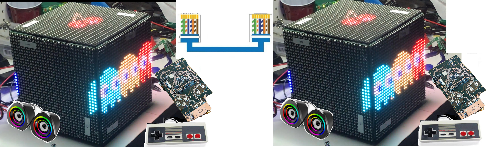

# Proyecto PBL — Videojuego en FPGA (Digital 2)

## Descripción

Proyecto de aprendizaje basado en problemas (PBL) del curso **Diseño Digital 2**. El objetivo general es construir colaborativamente una consola de videojuegos sobre FPGA, integrando un procesador RISC-V, periféricos, firmware y una interfaz de red.

El proyecto continúa el trabajo desarrollado en Digital 1, pero profundiza en el diseño y funcionamiento interno del sistema. En Digital 2, **femtoRV32 no se trata como una caja negra**: los estudiantes estudian las instrucciones del procesador, su ejecución y la relación entre el datapath, la unidad de control, la memoria y los periféricos.

La plataforma del sistema se construye con **LiteX**. Los estudiantes deben comprender cómo se integran en un SoC el procesador, los buses, las memorias, los registros CSR, los periféricos y el firmware.


*Referencia del montaje físico desarrollado en Digital 1.*

## Objetivos de aprendizaje

Al finalizar el proyecto, los estudiantes deberán poder:

1. Explicar la ejecución de las diferentes instrucciones utilizadas por femtoRV32.
2. Relacionar cada instrucción con las operaciones realizadas en el datapath y la unidad de control.
3. Integrar femtoRV32 en un SoC construido con LiteX.
4. Diseñar e integrar periféricos accesibles desde software.
5. Implementar firmware para controlar los periféricos y ejecutar la lógica del juego.
6. Incorporar y utilizar una interfaz de red dentro del sistema.
7. Implementar transferencias mediante acceso directo a memoria (DMA).
8. Utilizar herramientas de LiteX, como LiteScope, para observar y depurar señales internas del SoC.
9. Verificar el sistema mediante simulación antes de probarlo sobre FPGA.
10. Integrar el trabajo de todos los equipos en una única plataforma funcional.

## Resultado esperado

El resultado final será una **consola de videojuegos conectada**, implementada sobre FPGA y construida con LiteX. El sistema deberá incluir:

- femtoRV32 como procesador del SoC;
- firmware del juego;
- periféricos de entrada y salida;
- memoria para programa y datos;
- registros y periféricos mapeados en memoria;
- una interfaz de red utilizada por el proyecto;
- simulaciones y pruebas de integración;
- una implementación funcional sobre FPGA.

La interfaz de red no debe agregarse únicamente como demostración aislada: debe cumplir una función verificable dentro del proyecto final.

## Estudio de femtoRV32

El procesador forma parte del contenido evaluado. Para cada grupo de instrucciones estudiado, los estudiantes deben identificar:

- formato y codificación de la instrucción;
- registros fuente y destino;
- operación realizada por la ALU;
- acceso a memoria, cuando corresponda;
- modificación del contador de programa;
- señales de control involucradas;
- resultado observable mediante simulación.

El análisis debe relacionar el programa ejecutado con las señales internas del procesador. No es suficiente utilizar femtoRV32 únicamente como componente preconstruido.

## Uso de LiteX

LiteX se utilizará para construir e integrar el SoC. El proyecto debe mostrar claramente:

- definición de la plataforma FPGA;
- integración del procesador;
- mapa de memoria;
- buses y registros CSR;
- memorias ROM y RAM;
- periféricos desarrollados por los equipos;
- interfaz de red;
- generación y carga del firmware;
- flujo de simulación e implementación en hardware.

## Organización del curso

- Los estudiantes trabajarán en equipos responsables de componentes específicos del sistema.
- Cada equipo será responsable de planificar, implementar, verificar, documentar e integrar las tareas que le hayan sido asignadas.
- Cada equipo deberá entregar el RTL, firmware, simulaciones y documentación de su componente.
- Todos los componentes se integrarán en un único SoC LiteX compartido.
- Los cambios de cada equipo deberán respetar las interfaces y el mapa de memoria definidos para el sistema.
- La integración final deberá demostrar el funcionamiento conjunto del procesador, el juego, los periféricos y la red.

## Planificación y repositorios

El proyecto debe mantener un **planificador o cronograma compartido**. Para cada actividad se debe registrar como mínimo:

| Campo | Contenido |
|---|---|
| Tarea | Actividad concreta que debe realizarse |
| Responsable | Equipo y estudiante encargado |
| Fecha de inicio | Momento previsto para comenzar |
| Fecha de entrega | Momento previsto para finalizar |
| Dependencias | Tareas o módulos necesarios para comenzar |
| Estado | Pendiente, en desarrollo, bloqueada o terminada |
| Evidencia | Enlace al código, simulación, documento o prueba correspondiente |

Debe existir un **repositorio general del curso** que contenga la arquitectura compartida, la construcción base del SoC LiteX, las interfaces, el mapa de memoria y los elementos de integración. Cada equipo trabajará en su propio repositorio. El repositorio general distribuirá las actualizaciones comunes hacia los repositorios de los equipos, y los resultados validados de cada equipo deberán regresar al repositorio general mediante el mecanismo de integración definido para el curso.

Cada tarea debe tener un responsable explícito. La responsabilidad colectiva del equipo no reemplaza la asignación individual de actividades dentro del cronograma.

### Planificador recomendado: GitHub Projects

Se recomienda utilizar un **GitHub Project** asociado al repositorio general. Cada tarea debe crearse como un *issue* en el repositorio correspondiente y agregarse al proyecto general. El proyecto debe utilizar una vista de tabla para seguimiento y una vista de *roadmap* para el cronograma.

Configurar los siguientes campos:

- `Estado`: pendiente, en desarrollo, bloqueada o terminada;
- `Equipo`;
- `Responsable`;
- `Fecha de inicio`;
- `Fecha de entrega`;
- `Dependencias`;
- `Repositorio`;
- `Evidencia / Pull request`.

La plantilla de planificación y el formulario para crear tareas se encuentran en [`template/planificacion/`](./template/planificacion/) y [`template/.github/ISSUE_TEMPLATE/tarea.yml`](./template/.github/ISSUE_TEMPLATE/tarea.yml).

## Checkpoints sugeridos

1. **Especificación del sistema:** función del módulo, interfaces y mapa de memoria.
2. **Estudio de instrucciones:** datapath, control y simulación de las instrucciones asignadas.
3. **Integración en LiteX:** CPU, buses, memoria y CSR.
4. **Periférico y firmware:** RTL simulado y control desde C.
5. **Interfaz de red:** transmisión y recepción verificadas dentro del SoC.
6. **Integración completa:** ejecución del juego con todos los módulos.
7. **Validación en FPGA:** demostración funcional y documentación de resultados.
8. **Presentación final:** sustentación ante evaluadores externos.

## Evaluación final

El proyecto final será presentado ante un panel de **evaluadores externos**. La evaluación considerará:

- comprensión del funcionamiento interno de femtoRV32;
- calidad de la integración realizada con LiteX;
- funcionamiento de la interfaz de red;
- diseño y verificación de los periféricos;
- integración entre hardware y firmware;
- funcionamiento del sistema completo sobre FPGA;
- claridad de la documentación y de la presentación técnica;
- capacidad del equipo para justificar sus decisiones de diseño.

El resultado debe presentarse en el estado alcanzado al cierre del curso, acompañado por evidencia reproducible de simulación, integración y pruebas en hardware.

La puntuación y los niveles de desempeño están definidos en la [rúbrica de evaluación de proyecto](../rubrica_evaluacion_proyecto.md). Cada equipo debe revisarla desde el inicio del proyecto y conservar en el repositorio la evidencia específica de Digital 2.

Las tres evaluaciones del semestre se registrarán en la [hoja de evaluación de los proyectos](../evaluacion/README.md).

## Material de referencia

- [`imagenes/proyecto_01.png`](./imagenes/proyecto_01.png): referencia física del proyecto.
- [`imagenes/diagrama_soc_digital1_referencia.svg`](./imagenes/diagrama_soc_digital1_referencia.svg): arquitectura utilizada en Digital 1. En Digital 2 debe evolucionar a un SoC construido con LiteX, red, DMA y LiteScope.

## Plantilla de entrega

El directorio [`template/`](./template/) contiene la estructura mínima de entrega, un periférico `blink` escrito con Migen/LiteX y documentos guía para instrucciones, red, DMA, LiteScope, firmware y simulación.

Para probar el ejemplo:

```bash
cd template/sim
make
```
