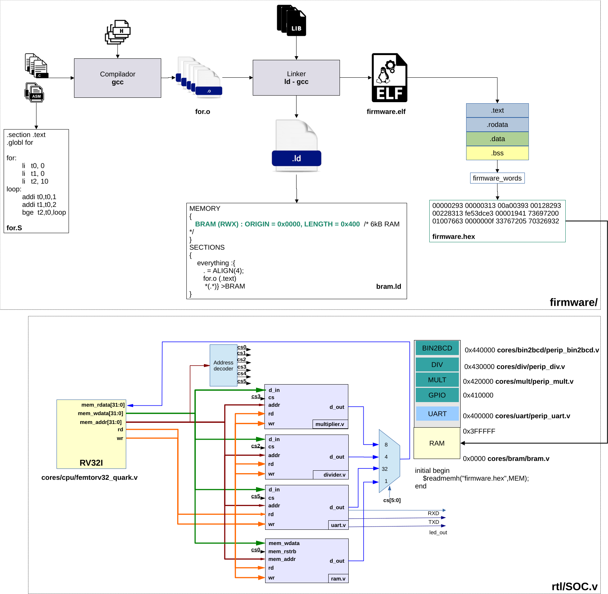
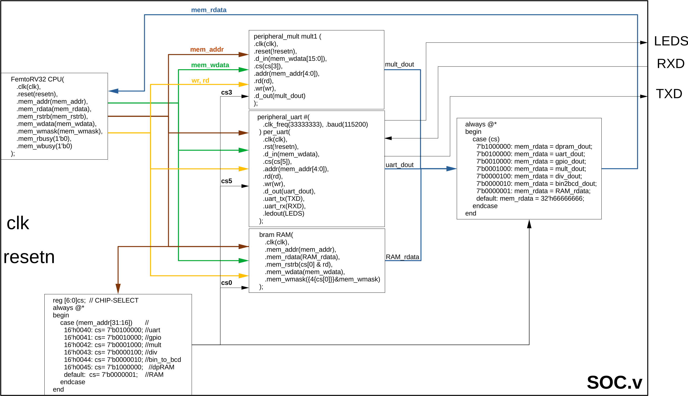
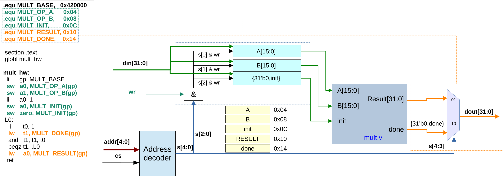

# Cómo agregar a `libfemtorv` una función para manejar un periférico

Este documento describe el procedimiento completo para exponer un periférico del SoC femtoRV32 mediante una función C de `libfemtorv.a`.

El trabajo tiene cuatro partes:

1. entender la interfaz MMIO del periférico en RTL;
2. implementar el controlador en `libfemtorv/`;
3. publicar la función en el encabezado de la librería;
4. compilar y comprobar la función con un programa de prueba.

El ejemplo existente `libfemtorv/hwmath.c` puede usarse como referencia para los periféricos multiplicador, divisor y raíz cuadrada.

La Figura 1 presenta la arquitectura completa: en la parte superior aparece el flujo de compilación del software, desde los archivos fuente y la librería hasta `firmware.hex`; en la parte inferior aparece la conexión del procesador RV32I con la BRAM y los periféricos del SoC.



**Figura 1. Arquitectura del procesador y flujo de generación del firmware.**

---

## 1. Arquitectura de acceso a periféricos

El procesador se comunica con los periféricos mediante **entrada/salida mapeada en memoria** (MMIO, *Memory-Mapped I/O*). Para el programa C, un registro del periférico parece una dirección de memoria. Una escritura o lectura sobre esa dirección produce una transacción en el bus del SoC.

Por ejemplo, los periféricos matemáticos actuales usan estas direcciones base:

| Periférico | Dirección base |
|---|---:|
| Raíz cuadrada | `0x00410000` |
| Multiplicador | `0x00420000` |
| Divisor | `0x00430000` |

En `rtl/SOC.v`, los bits `mem_addr[31:16]` seleccionan el periférico:

```verilog
case (mem_addr[31:16])
    16'h0041: cs = 9'b000010000; // sqrt
    16'h0042: cs = 9'b000001000; // mult
    16'h0043: cs = 9'b000000100; // div
    // ...
endcase
```

Los bits bajos de la dirección llegan al periférico como dirección interna de registro:

```verilog
.addr(mem_addr[4:0])
```

Por tanto, una dirección completa se forma así:

```text
dirección del registro = dirección base del periférico + offset del registro
```

Ejemplo:

```text
DIV_BASE   = 0x00430000
DIV_RESULT = 0x00000010

Dirección de DIV_RESULT = 0x00430010
```

La Figura 2 muestra cómo se materializa esta arquitectura en `SOC.v`. El procesador genera `mem_addr`, `mem_wdata`, `mem_rstrb` y `mem_wmask`; el decodificador convierte la dirección en una señal `cs`; y el multiplexor devuelve por `mem_rdata` la salida del periférico seleccionado.



**Figura 2. Instanciación del procesador, la memoria y los periféricos en `SOC.v`.**

---

## 2. Verificar primero la interfaz RTL

No se debe escribir el controlador C suponiendo el mapa de registros. Antes de programarlo, revise el módulo RTL del periférico y anote:

- dirección base asignada en `rtl/SOC.v`;
- señal `cs` conectada al periférico;
- offsets de todos los registros;
- tamaño de cada registro;
- registros de lectura y de escritura;
- secuencia necesaria para iniciar una operación;
- significado y polaridad de la señal `done`, `busy` o equivalente;
- momento en el que el resultado es válido;
- comportamiento durante reset;
- condiciones especiales, como división por cero o datos fuera de rango.

Una tabla de interfaz evita errores al implementar el controlador:

| Offset | Nombre | Acceso | Descripción |
|---:|---|---|---|
| `0x04` | `OPERAND_A` | Escritura | Primer operando |
| `0x08` | `OPERAND_B` | Escritura | Segundo operando |
| `0x0C` | `INIT` | Escritura | Inicia la operación |
| `0x10` | `RESULT` | Lectura | Resultado |
| `0x14` | `DONE` | Lectura | Bit 0 indica fin de operación |

Esta tabla es solamente una plantilla. Los nombres, offsets y protocolos reales deben salir del RTL del periférico que se va a manejar.

La Figura 3 muestra el multiplicador como ejemplo concreto. Los offsets `0x04`, `0x08` y `0x0C` seleccionan los registros de escritura `A`, `B` e `init`; los offsets `0x10` y `0x14` seleccionan las salidas `RESULT` y `done`. El código de software de la izquierda usa exactamente ese mapa de registros.



**Figura 3. Diagrama interno del periférico multiplicador y mapa de registros MMIO.**

### Comprobar la dirección base

La dirección base no puede repetirse. En este SoC se debe revisar el `case (mem_addr[31:16])` de `rtl/SOC.v` y confirmar que:

1. el valor de dirección está reservado para el periférico nuevo;
2. el `chip select` activa únicamente ese periférico;
3. la salida `d_out` del periférico está incluida en el multiplexor de lectura `mem_rdata`.

Si cualquiera de esos tres elementos falta, el controlador C no podrá comunicarse correctamente con el periférico.

---

## 3. Crear el archivo fuente del controlador

Dentro de `libfemtorv/`, cree un archivo `.c` con un nombre relacionado con el periférico. Por ejemplo:

```text
libfemtorv/accelerator.c
```

Incluya el encabezado público de la plataforma:

```c
#include <femtorv32.h>
```

Defina la dirección base y los offsets observados en RTL:

```c
#define ACCEL_BASE    0x00480000u

#define ACCEL_A       0x04u
#define ACCEL_B       0x08u
#define ACCEL_INIT    0x0Cu
#define ACCEL_RESULT  0x10u
#define ACCEL_DONE    0x14u
```

El sufijo `u` indica que las constantes son enteros sin signo.

### Usar `volatile`

Los registros MMIO deben accederse mediante un puntero `volatile`:

```c
volatile uint32_t *accel = (volatile uint32_t *)ACCEL_BASE;
```

`volatile` informa al compilador que cada lectura y cada escritura tiene un efecto externo y no debe eliminarse ni combinarse como si fuera acceso a RAM normal.

Sin `volatile`, el compilador podría:

- eliminar una escritura que considere redundante;
- leer `DONE` una sola vez y convertir el ciclo de espera en un ciclo infinito;
- cambiar el orden esperado de algunos accesos.

### Convertir offsets a índices

`accel` es un puntero a palabras de 32 bits. Por eso, al usar la forma `accel[indice]`, el índice debe expresarse en palabras y no en bytes:

```c
accel[ACCEL_A / 4] = a;
```

Con `ACCEL_A = 0x04`, la expresión anterior accede a:

```text
ACCEL_BASE + 1 palabra = ACCEL_BASE + 4 bytes
```

Olvidar la división entre cuatro es un error grave: `accel[0x04]` accedería a `ACCEL_BASE + 0x10`, no a `ACCEL_BASE + 0x04`.

---

## 4. Implementar la función pública

Suponga un periférico que recibe dos operandos de 16 bits, necesita un pulso `1` → `0` en `INIT`, entrega un resultado de 32 bits y coloca en uno el bit 0 de `DONE` al terminar.

La función puede escribirse así:

```c
#include <femtorv32.h>

#define ACCEL_BASE    0x00480000u
#define ACCEL_A       0x04u
#define ACCEL_B       0x08u
#define ACCEL_INIT    0x0Cu
#define ACCEL_RESULT  0x10u
#define ACCEL_DONE    0x14u

uint32_t hw_accel(uint16_t a, uint16_t b)
{
    volatile uint32_t *accel = (volatile uint32_t *)ACCEL_BASE;

    accel[ACCEL_A / 4] = a;
    accel[ACCEL_B / 4] = b;

    /* Crear el pulso de inicio exigido por el RTL. */
    accel[ACCEL_INIT / 4] = 1u;
    accel[ACCEL_INIT / 4] = 0u;

    /* Esperar hasta que el bit 0 indique fin de operación. */
    while ((accel[ACCEL_DONE / 4] & 1u) == 0u)
        ;

    return accel[ACCEL_RESULT / 4];
}
```

El orden de estas operaciones corresponde al protocolo del ejemplo:

1. escribir los operandos;
2. generar el pulso de inicio;
3. esperar la terminación;
4. leer el resultado.

No copie esta secuencia automáticamente para todos los periféricos. Si el RTL usa otro protocolo —por ejemplo, `start` auto-limpiable, una señal `busy` activa en uno, FIFO, interrupción o varios registros de resultado— la función debe respetar ese protocolo.

### Máscara y conversión del resultado

Si solamente una parte de `d_out` contiene el resultado, aplique una máscara antes de retornar:

```c
return (uint16_t)(accel[ACCEL_RESULT / 4] & 0xFFFFu);
```

La máscara debe corresponder al ancho real definido en RTL. No use `0xFFFF` para un resultado de 20, 24 o 32 bits.

### Evitar un bloqueo permanente

El ejemplo usa espera por sondeo (*polling*) sin tiempo límite. Es simple, pero si el periférico no activa `DONE`, el procesador queda bloqueado para siempre.

Para una función que deba detectar fallos puede usarse un límite de iteraciones y retornar un estado separado del resultado:

```c
int hw_accel_timeout(uint16_t a, uint16_t b, uint32_t *result)
{
    volatile uint32_t *accel = (volatile uint32_t *)ACCEL_BASE;
    uint32_t timeout = 100000u;

    if (result == 0)
        return -1;

    accel[ACCEL_A / 4] = a;
    accel[ACCEL_B / 4] = b;
    accel[ACCEL_INIT / 4] = 1u;
    accel[ACCEL_INIT / 4] = 0u;

    while ((accel[ACCEL_DONE / 4] & 1u) == 0u) {
        if (--timeout == 0u)
            return -2;
    }

    *result = accel[ACCEL_RESULT / 4];
    return 0;
}
```

El valor de `timeout` debe calcularse a partir de la latencia máxima del periférico y de la frecuencia del procesador. No debe escogerse arbitrariamente para una versión final.

---

## 5. Publicar la función en el encabezado

Agregue el prototipo a:

```text
libfemtorv/include/femtorv32.h
```

Ejemplo:

```c
extern uint32_t hw_accel(uint16_t a, uint16_t b);
```

El prototipo y la implementación deben coincidir exactamente en:

- nombre de función;
- tipo de retorno;
- cantidad de parámetros;
- tipo y orden de los parámetros.

Como `femtorv32.h` ya incluye `<stdint.h>`, pueden usarse tipos de ancho fijo como `uint8_t`, `uint16_t` y `uint32_t`.

### Por qué usar tipos de ancho fijo

Los registros hardware tienen anchos definidos. Un tipo como `uint16_t` expresa que el dato tiene exactamente 16 bits, mientras que el tamaño de tipos como `int` puede depender de la arquitectura o del compilador.

El tipo de la API debe representar el dato útil del periférico, aunque las transacciones MMIO del bus se hagan mediante palabras de 32 bits.

---

## 6. Agregar el módulo al archivo de la librería

Abra:

```text
libfemtorv/Makefile
```

Agregue el nuevo objeto a la variable `OBJECTS`. Por ejemplo:

```make
OBJECTS = microwait.o milliwait.o wait_cycles.o femtorv32.o uart.o \
          cycles_32.o print.o printf.o hwmath.o accelerator.o
```

La regla genérica existente compilará automáticamente:

```text
accelerator.c -> accelerator.o
```

Después, `ar` incorporará `accelerator.o` en `libfemtorv.a`.

Si se crea el archivo `.c` pero no se agrega su `.o` a `OBJECTS`, el código compilará de manera aislada solamente si se solicita explícitamente, pero la función no quedará dentro de la librería. Al enlazar el programa aparecerá un error similar a:

```text
undefined reference to `hw_accel'
```

---

## 7. Crear un programa de prueba

Cree el archivo junto al `Makefile` principal:

```text
test_accelerator.c
```

Ejemplo:

```c
#include <femtorv32.h>

int main(void)
{
    uint16_t a = 12u;
    uint16_t b = 34u;
    uint32_t result = hw_accel(a, b);

    printf("hw_accel(%d, %d) = %d\n", a, b, result);

    if (result != 408u) {
        printf("ERROR: resultado esperado = 408\n");
        return 1;
    }

    printf("PRUEBA CORRECTA\n");
    return 0;
}
```

El valor esperado debe calcularse independientemente del periférico. No use como valor esperado otra llamada a la misma función que se está probando.

Una prueba adecuada debe incluir:

- un caso sencillo cuyo resultado pueda comprobarse manualmente;
- cero como entrada, si está permitido;
- valores mínimos y máximos;
- casos que produzcan acarreo o usen todos los bits del resultado;
- entradas inválidas y comportamiento de error, si existen;
- varias operaciones consecutivas para verificar que `DONE` e `INIT` se rearman correctamente.

---

## 8. Compilar la librería y el firmware

Desde `firmware/c/`, reconstruya primero la librería:

```bash
make -C libfemtorv clean all
```

Compruebe que el nuevo módulo quedó dentro de `libfemtorv.a`:

```bash
riscv64-unknown-elf-ar t libfemtorv/libfemtorv.a
```

La lista debe contener:

```text
accelerator.o
```

También puede verificar que la función fue exportada:

```bash
riscv64-unknown-elf-nm libfemtorv/libfemtorv.a | grep hw_accel
```

Debe aparecer un símbolo global definido, normalmente marcado con `T`:

```text
00000000 T hw_accel
```

Para hacer una reconstrucción limpia del programa de prueba:

```bash
make clean
cp libfemtorv/crt0_baremetal.o .
make TARGET=test_accelerator
```

La copia de `crt0_baremetal.o` es necesaria después de `make clean`, porque el `linker.ld` principal espera ese objeto en `firmware/c/` y la regla `clean` lo elimina.

El proceso debe producir:

- `firmware.elf`: programa enlazado;
- `firmware.lst`: encabezados y desensamblado;
- `firmware.map`: mapa del enlazador;
- `firmware.hex`: imagen para la BRAM;
- una copia de `firmware.hex` en `rtl/`.

---

## 9. Revisar el ejecutable antes de simular

Busque la función en el desensamblado:

```bash
grep -n -A25 -B5 '<hw_accel>' firmware.lst
```

Esta revisión permite comprobar que:

- la función quedó enlazada;
- el programa realmente la llama;
- las direcciones inmediatas corresponden a la dirección base esperada;
- existen cargas y escrituras MMIO;
- no se enlazó por error una versión vieja de la librería.

También puede revisar el mapa:

```bash
grep -n 'hw_accel\|accelerator.o' firmware.map
```

---

## 10. Simular y observar la interfaz

Después de generar `firmware.hex`, ejecute el banco de pruebas del SoC desde `rtl/` según el flujo de simulación del proyecto.

La salida UART del programa confirma el resultado funcional, pero una depuración completa debe comprobar también las transacciones MMIO en el VCD:

1. escritura del operando A en el offset correcto;
2. escritura del operando B en el offset correcto;
3. escritura de `1` en `INIT`;
4. escritura de `0` en `INIT`, si el protocolo exige un pulso explícito;
5. activación del `chip select` correcto;
6. transición de `DONE` en la polaridad esperada;
7. lectura de `RESULT` después de `DONE`;
8. valor de `mem_rdata` retornado al procesador.

Si el programa se queda esperando, determine primero si ocurre una de estas condiciones:

- `DONE` nunca se activa;
- se está leyendo el offset equivocado;
- el `chip select` no corresponde a la dirección base;
- el periférico no fue agregado al multiplexor de `mem_rdata`;
- `INIT` no recibió la secuencia exigida;
- el reset del periférico permanece activo;
- el software está usando una librería antigua que no fue recompilada.

---

## 11. Errores frecuentes

### Dirección base incorrecta

**Síntoma:** no ocurre ninguna operación o responde otro periférico.

**Revisión:** compare la constante `*_BASE` con el `case (mem_addr[31:16])` de `rtl/SOC.v`.

### Offsets intercambiados

**Síntoma:** `DONE` se interpreta como resultado, el resultado siempre parece `0` o la función termina en un momento incorrecto.

**Revisión:** confirme cada offset directamente en el `case` interno del módulo RTL.

### Índice sin dividir entre cuatro

**Síntoma:** la función accede a otro registro.

Código incorrecto:

```c
accel[ACCEL_A] = a;
```

Código correcto para un puntero `uint32_t *`:

```c
accel[ACCEL_A / 4] = a;
```

### Falta de `volatile`

**Síntoma:** el comportamiento cambia con la optimización o el ciclo de espera no vuelve a leer `DONE`.

**Corrección:** use un puntero `volatile` para todos los registros MMIO.

### Protocolo de inicio incorrecto

**Síntoma:** el periférico nunca empieza, se inicia varias veces o solamente funciona una vez.

**Revisión:** determine en RTL si `INIT` necesita nivel, pulso explícito, flanco o escritura auto-limpiable.

### El archivo no está en `OBJECTS`

**Síntoma:** `undefined reference` durante el enlace.

**Corrección:** agregue el `.o` correspondiente a `libfemtorv/Makefile` y reconstruya la librería.

### Encabezado e implementación no coinciden

**Síntoma:** advertencias, argumentos interpretados incorrectamente o truncamiento del resultado.

**Corrección:** haga idénticos el prototipo de `femtorv32.h` y la definición del archivo `.c`.

### Se está enlazando una librería anterior

**Síntoma:** el código fuente parece correcto, pero el desensamblado no contiene los cambios.

**Corrección:** ejecute `make -C libfemtorv clean all` antes de reconstruir el firmware y compruebe el símbolo con `nm`.

### El periférico escribe más bits de los que acepta el RTL

**Síntoma:** los operandos aparecen truncados.

**Revisión:** compare el tipo de la API, el ancho de `mem_wdata` conectado en `SOC.v` y el ancho del registro dentro del periférico.

---

## 12. Lista de comprobación final

### RTL

- [ ] La dirección base es única.
- [ ] El periférico recibe el `chip select` correcto.
- [ ] Los offsets están documentados y alineados.
- [ ] `d_out` está conectado al multiplexor de lectura.
- [ ] El protocolo de `INIT`, `DONE` y `RESULT` está verificado.
- [ ] Los anchos de entrada y salida están verificados.

### Librería

- [ ] Existe un archivo `.c` específico y legible.
- [ ] Los accesos MMIO usan `volatile`.
- [ ] Los offsets en bytes se convierten correctamente a índices de palabra.
- [ ] El prototipo público está en `libfemtorv/include/femtorv32.h`.
- [ ] El nuevo `.o` está incluido en `OBJECTS`.
- [ ] `ar t` muestra el objeto dentro de `libfemtorv.a`.
- [ ] `nm` muestra la función como símbolo definido.

### Prueba

- [ ] Existe un programa `test_*.c` con resultados esperados independientes.
- [ ] El firmware compila y enlaza sin referencias indefinidas.
- [ ] `firmware.lst` contiene la función nueva.
- [ ] La simulación termina y reporta los resultados esperados.
- [ ] El VCD confirma dirección, datos, orden y protocolo de los accesos MMIO.
- [ ] Se probaron varias operaciones consecutivas y casos límite.

Cuando todos estos puntos se cumplen, la función ya forma parte de la API pública de `libfemtorv` y puede utilizarse desde cualquier firmware que incluya `<femtorv32.h>` y enlace con `-lfemtorv`.
