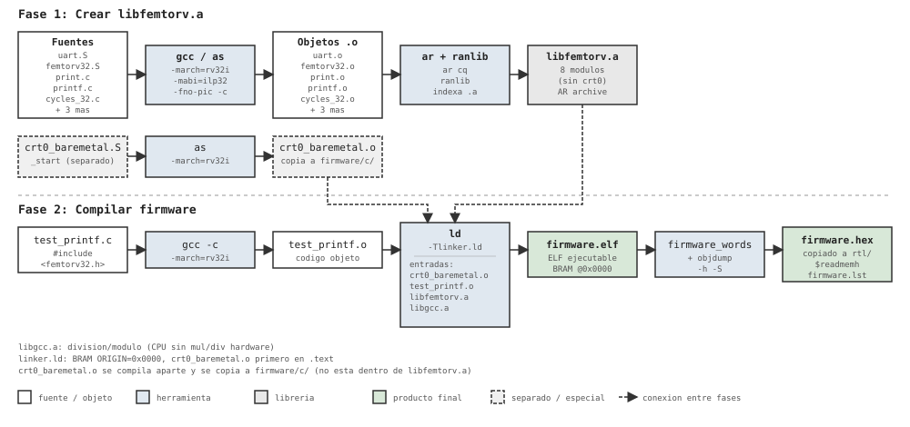

# FemtoRV32 C Firmware

Firmware en C para el procesador femtoRV32 (RISC-V RV32I, sin multiply/divide hardware). Usa una librería estática `libfemtorv.a` con funciones de I/O, timing y sistema.

## Estructura del directorio

```
firmware/c/
├── Makefile                  # Build del firmware (compila, linkea, genera .hex)
├── linker.ld                 # Script de linker: BRAM en 0x0000, crt0 primero
├── test_printf.c             # Programa de prueba: printf, getchar, LEDs
├── hello.c                   # Programa mínimo de ejemplo
├── crt0_baremetal.o          # Startup (copiado de libfemtorv/)
├── firmware.elf              # ELF compilado (salida del linker)
├── firmware.hex              # Hex para $readmemh en BRAM (copiado a rtl/)
├── firmware.lst              # Disassembly completo
├── firmware.map              # Mapa de memoria del linker
└── libfemtorv/               # Librería estática
    ├── Makefile              # Build de libfemtorv.a
    ├── crt0_baremetal.S      # Startup: gp=UART_BASE, sp=RAM_SIZE, call main
    ├── femtorv32.S           # exit(), abort()
    ├── uart.S                # putchar(), getchar() — I/O UART por polling
    ├── print.c               # print_string, print_dec, print_hex, puts
    ├── printf.c              # printf() minimal (%s, %d, %x, %c)
    ├── cycles_32.c           # cycles() — contador de ciclos (rdcycle)
    ├── wait_cycles.c         # wait_cycles(n) — espera n ciclos
    ├── milliwait.c           # milliwait(ms) — espera en milisegundos
    ├── microwait.c           # microwait(us) — espera en microsegundos
    ├── libfemtorv.a          # Archivo estático (.a) con todos los .o
    ├── crt0_baremetal.o      # Startup compilado (se copia a firmware/c/)
    └── include/
        ├── femtorv32.h           # API pública: IO, printf, getchar, timing
        ├── femtostdlib.h         # Wrappers de stdlib (printf, print_*)
        └── soc_memory_map.h      # Mapa común para C y ensamblador
```

## libfemtorv.a

Documentación detallada de la librería, sus componentes, el startup y el mapa
de memoria: [`libfemtorv/README`](libfemtorv/README).

### Qué contiene

`libfemtorv.a` es un archivo estático (AR archive) con 9 módulos objeto:

| Módulo     | Fuente         | Funciones                          |
|------------|---------------|-----------------------------------|
| uart.o     | uart.S        | `putchar`, `getchar`              |
| print.o    | print.c       | `print_string`, `print_dec`, `print_hex`, `print_hex_digits`, `puts` |
| printf.o   | printf.c      | `printf`                          |
| cycles_32.o| cycles_32.c   | `cycles`                          |
| wait_cycles.o | wait_cycles.c | `wait_cycles`                   |
| milliwait.o   | milliwait.c   | `milliwait`                    |
| microwait.o   | microwait.c   | `microwait`                    |
| femtorv32.o   | femtorv32.S   | `exit`, `abort`                |
| hwmath.o      | hwmath.c      | `hw_mult`, `hw_div`, `hw_sqrt`|

`crt0_baremetal.o` **no** está dentro de `libfemtorv.a` — se compila por separado y se copia a `firmware/c/` porque el linker lo necesita como primer objeto (definido en `linker.ld`).

### Cómo se crea

```bash
cd libfemtorv
make
```

El Makefile de `libfemtorv/` ejecuta:

1. Compila cada `.c` con `riscv64-unknown-elf-gcc -march=rv32i -mabi=ilp32 -c`
2. Compila cada `.S` con `riscv64-unknown-elf-gcc -x assembler-with-cpp`; así C y ensamblador incluyen el mismo `soc_memory_map.h`
3. Empaqueta todos los `.o` con `riscv64-unknown-elf-ar cq libfemtorv.a $(OBJECTS)`
4. Indexa con `riscv64-unknown-elf-ranlib libfemtorv.a`
5. Compila `crt0_baremetal.S` → `crt0_baremetal.o` (fuera del .a)

### Cómo ver su contenido

```bash
# Listar módulos dentro del .a
riscv64-unknown-elf-ar t libfemtorv/libfemtorv.a

# Ver símbolos (funciones) de cada módulo
riscv64-unknown-elf-nm libfemtorv/libfemtorv.a

# Disassembly completo de la librería
riscv64-unknown-elf-objdump -d libfemtorv/libfemtorv.a
```

## Compilación del firmware

```bash
make
```

El Makefile de `firmware/c/` ejecuta:

1. **Compilar** `test_printf.c` → `test_printf.o` (gcc -march=rv32i)
2. **Copiar** `crt0_baremetal.o` de `libfemtorv/` a `firmware/c/`
3. **Linkar** `crt0_baremetal.o` + `test_printf.o` + `libfemtorv.a` + `libgcc.a` → `firmware.elf`
   - Script `linker.ld`: todo en BRAM desde 0x0000, crt0 primero
   - `libgcc.a` provee funciones de división/módulo (el CPU no tiene mul/div hardware)
4. **Disassembly** `firmware.elf` → `firmware.lst` (objdump -h -S)
5. **Convertir** `firmware.elf` → `firmware.hex` (herramienta `firmware_words`)
6. **Copiar** `firmware.hex` a `../../rtl/` para simulación

## Memoria mapeada (IO)

| Registro       | Dirección | Lectura                        | Escritura         |
|----------------|---------|----------------------------------|-------------------|
| `UART_DATA`    | `0x400008` | `{24'b0, rx_data[7:0]}`      | Dato para transmitir |
| `UART_CONTROL` | `0x400010` | `tx_busy`, `rx_avail`, `rx_error` | Control UART y LED |

Las bases de los demás periféricos están declaradas directamente en
`libfemtorv/include/soc_memory_map.h`: `SQRT_BASE=0x410000`,
`MULT_BASE=0x420000`, `DIV_BASE=0x430000` y las restantes direcciones
implementadas por el decodificador de `SOC.v`.

Bits de `UART_CONTROL` (escritura):
- bit 0: `tx_wr` — pulso para iniciar transmisión
- bit 1: `rx_ack` — pulso para limpiar `rx_avail`
- bit 2: `ledout` — LED de control

Bits de `UART_CONTROL` (lectura):
- bit 9: `tx_busy`
- bit 8: `rx_avail`
- bit 7: `rx_error`

## Toolchain

```bash
riscv64-unknown-elf-gcc      # compilador C
riscv64-unknown-elf-as       # ensamblador
riscv64-unknown-elf-ld       # linker
riscv64-unknown-elf-ar       # archivero (crea .a)
riscv64-unknown-elf-ranlib   # indexador de .a
riscv64-unknown-elf-objdump  # disassembly
riscv64-unknown-elf-objcopy  # conversión de formatos
```

Flags comunes: `-march=rv32i -mabi=ilp32 -fno-pic --no-relax`

## Diagrama de flujo de compilación



Versión interactiva: abrir `compilation_flow.html` en un navegador.
